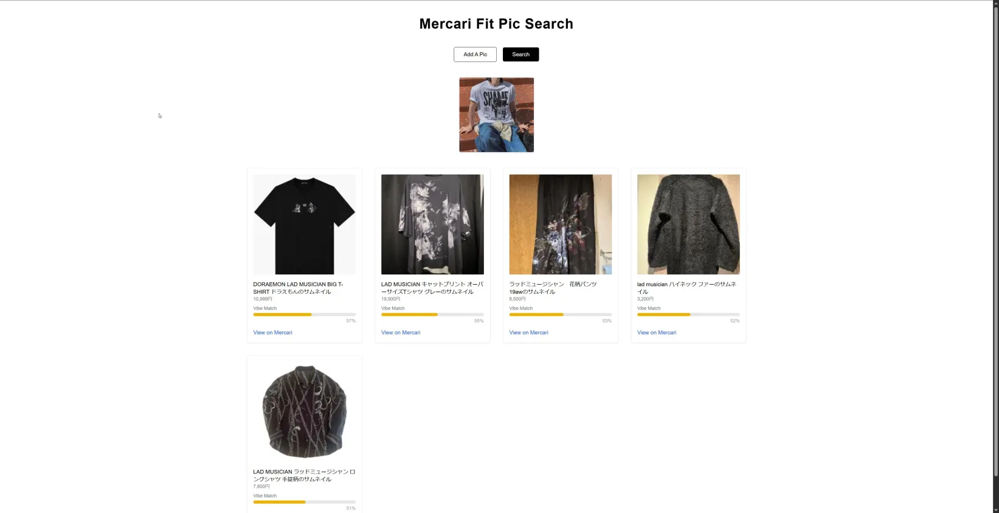

# Mercari Visual Fit Search
- This project is a full-stack visual similarity search tool for second-hand Japanese fashion on Mercari Japan. You upload a fit pic, and the app finds visually similar clothing items using CLIP embeddings.

## Features
- Upload an image and receive visually similar Mercari listings
- Uses OpenAI’s CLIP to calculate similarity between user image and Mercari listings
- Scrapes latest listings from Mercari’s LAD MUSICIAN brand page
- Automatically downloads and saves new listing images
- Auto-generates and updates CLIP image embeddings on scrape
- Skips duplicates across multiple runs
- UI built with React + Tailwind styled to feel like SSENSE
- Backend powered by Flask, Python, and Playwright

